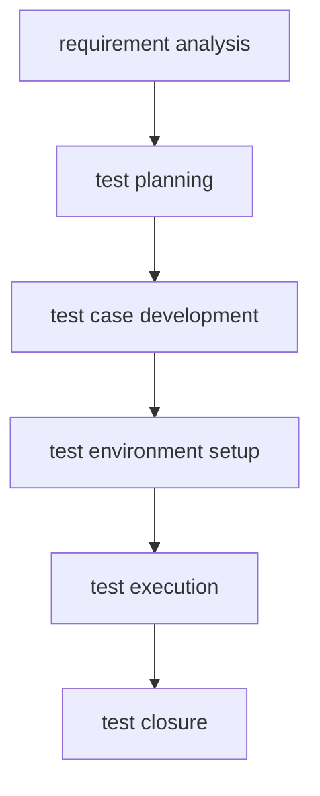
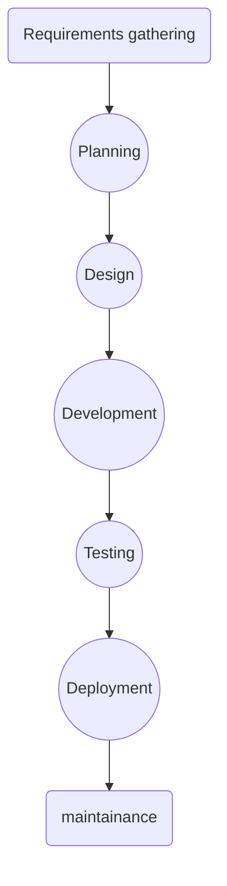
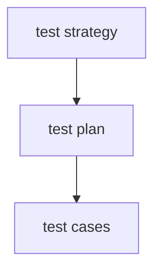
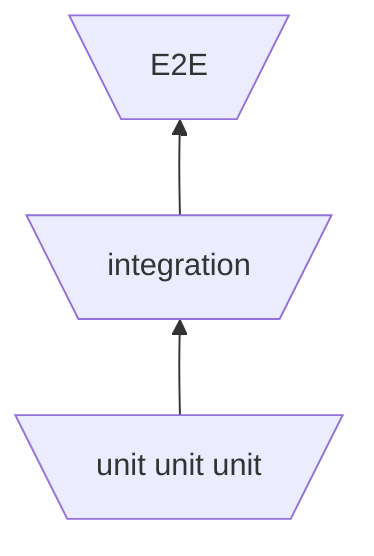

# Automated Testing Interview Questions

## Introduction

This document contains common interview questions for QA Automation Engineers.

---

# Testing Fundamentals

1. **What is software testing?**
*Software testing is the process of verifying and validating that a software application behaves as expected and meets its specified requirements.
The goal is to identify defects before the software reaches users and to improve the overall quality,reliability and maintainability of the product.*


1. **Why is software testing important?**
Because without it:
- software might crush unexpectedly
- the software might produce unpredictable results
- there might be security vulnerabilities
- user's data mightb get lost
- overal poor user experience

2. **What is the difference between verification and validation?**
| Verification | Validation |
| ------------ | ---------- |
| Are we building the product correctly | Are we building the right product |
| Checks spefication and design | Checks user needs and expectations |
| Usually static activities | Usually dynamic activities |
| Happens during development | Happens after iplementantion |

3. **What is the difference between an error, defect, bug, and failure?**
Error happens because of human mistake during development, defect is a result/flaw because of an error introduced in software, and failure is the incorrect behaviour observed when the defect is executed.

4. **What is the Software Testing Life Cycle (STLC)?**
STLC is a structured process that defines the phases and activities performed by the testing team to ensure software quality.It starts with requiremnt analysis and end with test closure and reporting.



5. **What is the Software Development Life Cycle (SDLC)?**
It is  a structured process used to plan, design, develop, test, deploy and maintain software. It describes the stages that the software product goes through from the initial idea to production and ongoing maintenance. 



6. **What is a test case?**
A test case is a set of conditions used to verify one specific behaviour.

7. **What is a test suite?**
A collection of test cases.
### Example (Authentication):
- Valid Login(test case)
- Invalid login (test case)
- Locked user (test case)
- Forgot password (test case)
- Logout (test case)

8. **What is a test plan?**
A document that describes how testing will be performed for a project:
Usually includes:
- scope
- objectives
- schedule
- risks
- test environments
- exit criterias

9. **What is a test strategy?**
A high-level approach that defines how the organisation performs testing.
It usually includes:

- Testing levels
- Automation strategy
- Tools
- Risk management
- Reporting process
Think of it like this:




10. **What is an assertion?**
Assertion verify that the actual result matches the expected result.


11. **What is the Test Pyramid?**
The test pyramid describes the ideal distrubution of automated tests



12. **What is Shift Left Testing?**
Is the practice of perfoming testing activities earlier in  the software development lif cycle(sdlc) in order to find defects as soon as possible.

---

# Testing Types

1. What is unit testing?
2. What is integration testing?
3. What is system testing?
4. What is end-to-end testing?
5. What is smoke testing?
6. What is sanity testing?
7. What is regression testing?
8. What is acceptance testing?
9. What is the difference between smoke and regression testing?
10. What is the difference between system testing and end-to-end testing?
11. What is the difference between functional and non-functional testing?
12. What is performance testing?
13. What is load testing?
14. What is stress testing?
15. What is security testing?
16. What is accessibility testing?
17. What is usability testing?

### extra

### a) api testing concepts

### b) sql basics

---

# Automation Fundamentals

1. What is test automation?
2. What are the advantages of automation?
3. What should NOT be automated?
4. What makes a good automated test?
5. What is a flaky test?
6. How do you reduce flaky tests?
7. What is data-driven testing?
8. What is parameterization?
9. What are fixtures?
10. What is Faker?
11. What is the Page Object Model (POM)?
12. Why should tests be independent?
13. What are explicit waits?
14. Why should browser.pause() be avoided?
15. What makes a good selector?
16. What is AAA (Arrange, Act, Assert)?
17. What is DRY?
18. Why use SOLID in automation frameworks?
19. What is test isolation?
20. What is mocking?

---

# JavaScript

1. Explain async/await.
2. What is a Promise?
3. What is the event loop?
4. Difference between == and ===?
5. **Difference between var, let, and const?**

```js
function test() {

    if (true) {
        var a = 1;
        let b = 2;
    }

    console.log(a);
    console.log(b);
}

test();
// it will print 1 for a
// and reference error for b
// because let and const are block scoped and var function scope

```

var is function-scoped, meaning it's available anywhere inside the function where it's declared, regardless of nested blocks like if or for. let and const are block-scoped, meaning they're available only within the nearest enclosing {} block.

**other example:**

```js
 if (true) {
        var a = 1;

    }
console.log(a);

//prints 1 
```

```
but if we do the same with var or const:
```

```js
     if (true) {

        let b = 2;
    }
//prints referenceError
```

1. What are arrow functions?
2. What are callbacks?
3. What are ES Modules?
4. What is CommonJS?
5. What is package.json?
6. What is npm?
7. What is Node.js?
8. What are environment variables?
9. What is .env?

---

# WebdriverIO

1. What is WebdriverIO?
2. Explain wdio.conf.js.
3. What are capabilities?
4. What are services?
5. What are reporters?
6. What are hooks?
7. Difference between browser and element commands?
8. How do you locate elements?
9. What are waitUntil(), waitForDisplayed(), and waitForClickable()?
10. How do you upload files?
11. How do you handle alerts?
12. How do you switch windows?
13. How do you execute JavaScript in the browser?
14. How do you handle iframes?
15. How do you take screenshots?
16. How do you run tests in parallel?

---

# Playwright

1. What is Playwright?
2. Selenium vs Playwright?
3. Playwright vs WebdriverIO?
4. What are Playwright fixtures?
5. What are browser contexts?
6. How does Playwright auto-waiting work?
7. How do you intercept network requests?

---

# Selenium

1. What is Selenium?
2. Selenium vs WebdriverIO?
3. Selenium vs Playwright?
4. What is Selenium Grid?
5. What are Desired Capabilities?
6. How does Selenium communicate with browsers?

---

# Jest / Mocha / Chai

1. How does Jest differ from Mocha?
2. What is Chai?
3. What are assertions?
4. What are hooks?
5. beforeEach() vs beforeAll()?
6. afterEach() vs afterAll()?
7. What is test parameterization?

---

# BDD

1. What is BDD?
2. Difference between BDD and TDD?
3. What is Gherkin?
4. What are Feature files?
5. What are Scenarios?
6. What are Step Definitions?
7. Given, When, Then explained.

---

# CI/CD

1. What is CI/CD?
2. Why is CI important?
3. Why is CD important?
4. What happens when you push code?
5. Where do automated tests fit into a pipeline?
6. What is Jenkins?
7. What is GitHub Actions?
8. What is a pipeline?

---

# Framework Design

1. Describe your automation framework.
2. How would you design a framework from scratch?
3. Why use the Page Object Model?
4. Where should test data be stored?
5. How do you organise a large automation project?

---

# Behavioural Questions

1. Tell me about your automation project.
2. Describe a difficult bug you found.
3. Describe a flaky test you fixed.
4. Have you worked in Agile?
5. How do you debug a failed test?
6. How do you prioritise automation?
7. How do you review another engineer's test?
8. What would you improve in your current framework?
9. What is your biggest automation challenge?
10. Why do you want to work here?

---

# Advanced Automation

1. What is the difference between implicit and explicit waits?
2. What is a stale element reference?
3. How do you handle dynamic elements?
4. How do you handle file downloads?
5. How do you handle file uploads?
6. How do you handle authentication?
7. How do you test APIs?
8. What is contract testing?
9. What is visual testing?
10. What is cross-browser testing?
11. What is parallel execution?
12. What are the advantages of parallel execution?
13. What challenges can parallel execution introduce?
14. How do you handle dynamic test data?
15. How do you test email functionality?
16. How do you test third-party integrations?
17. How do you handle retries in automation?
18. What metrics would you use to evaluate an automation suite?
19. How do you reduce maintenance costs in automation?
20. How do you decide whether a test should be automated?

---

# Advanced JavaScript

1. What is destructuring?
2. What is the spread operator (...)?
3. What is the rest operator (...)?
4. What is optional chaining (?.)?
5. What are template literals?
6. What is destructuring assignment?
7. What is the difference between null and undefined?
8. What is the difference between map(), filter(), and forEach()?
9. What is the difference between map() and reduce()?
10. What is object immutability?
11. What is a closure?
12. What is hoisting?
13. What is scope?
14. What is the difference between synchronous and asynchronous code?
15. What is Promise.all()?
16. What is Promise.race()?
17. What is exception handling?
18. What is try/catch/finally?
19. What are higher-order functions?
20. What is destructuring used for in test automation?

---

# Git & Version Control

1. What is Git?
2. What is GitHub?
3. What is version control?
4. Why is Git important for automation engineers?
5. What is a repository?
6. What is a branch?
7. What is the difference between main and feature branches?
8. What is a merge?
9. What is a merge conflict?
10. How do you resolve a merge conflict?
11. What is a pull request (PR)?
12. What is a code review?
13. What is a commit?
14. What makes a good commit message?
15. What is git stash?
16. What is git rebase?
17. What is git cherry-pick?
18. What is git revert?
19. What is the difference between merge and rebase?
20. Describe a typical Git workflow.

---

# Framework Architecture & Design

1. How do you organise page objects?
2. Where should assertions belong?
3. How do you manage test data?
4. How do you structure utility classes?
5. How do you separate configuration from code?
6. How do you organise test folders?
7. How do you organise reusable components?
8. How do you design a scalable automation framework?
9. How do you support multiple environments?
10. How do you support multiple browsers?
11. How do you manage secrets and credentials?
12. How do you manage environment variables?
13. How do you structure configuration files?
14. How do you avoid code duplication?
15. How do you decide what belongs in a Page Object?
16. What should not be placed inside a Page Object?
17. How do you design reusable helper functions?
18. How do you manage test reports?
19. How do you integrate automation into CI/CD?
20. Describe the architecture of your current automation framework.

---

# Real Project & Technical Review Questions

1. Walk me through your automation framework.
2. Why did you choose WebdriverIO?
3. Why did you choose Playwright?
4. What challenges did you face in your project?
5. How did you handle flaky tests?
6. What would you improve in your framework?
7. How do you debug a failing test?
8. How do you investigate a CI failure?
9. What was the most difficult bug you found?
10. What was the most difficult automation problem you solved?
11. How would you automate a login flow?
12. How would you automate an e-commerce checkout flow?
13. How would you automate a file upload feature?
14. How would you automate a search feature?
15. How would you test pagination?
16. How would you test a date picker?
17. How would you test a table with dynamic data?
18. How would you test a multi-step form?
19. How would you automate OTP authentication?
20. How would you test an API and UI together?

