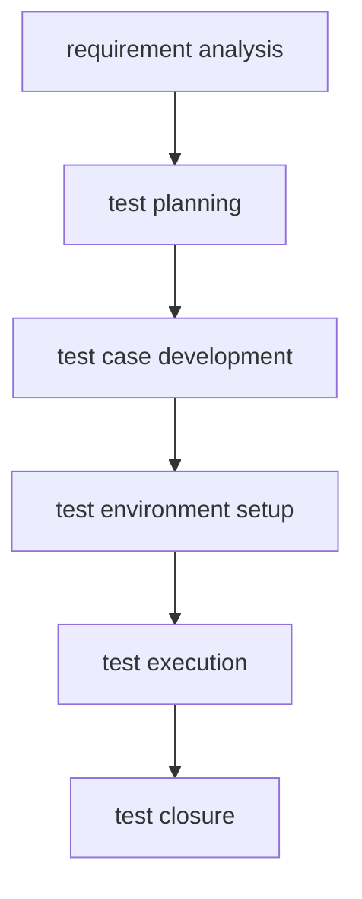
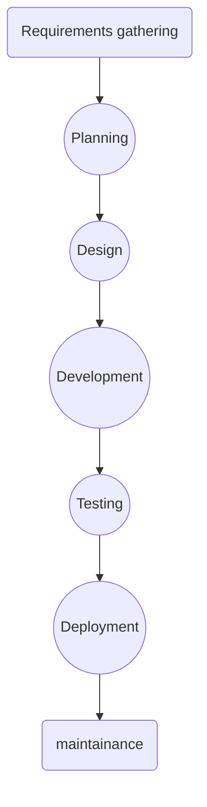
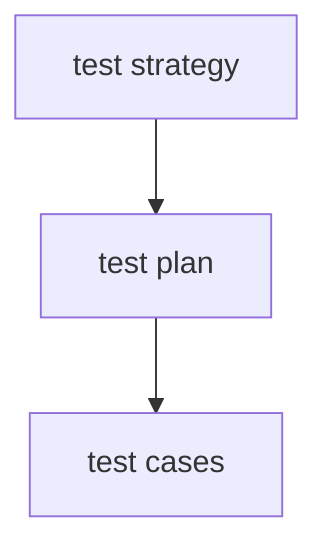
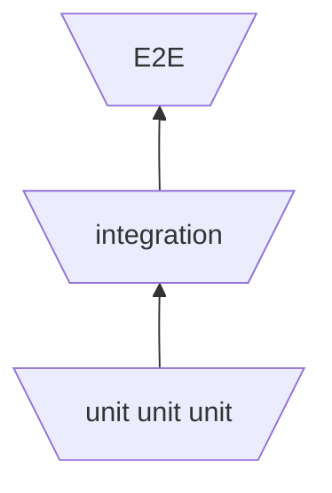

# Automated Testing Interview Questions

## Introduction

This document contains common interview questions for QA Automation Engineers.

---

# Testing Fundamentals

1. **What is software testing?**

*Software testing is the process of verifying and validating that a software application behaves as expected and meets its specified requirements.
The goal is to identify defects before the software reaches users and to improve the overall quality,reliability and maintainability of the product.*

1. **Why is software testing important?**

Because without it:

- software might crush unexpectedly
- the software might produce unpredictable results
- there might be security vulnerabilities
- user's data might get lost
- overal poor user experience

1. **What is the difference between verification and validation?**


| Verification                          | Validation                         |
| ------------------------------------- | ---------------------------------- |
| Are we building the product correctly | Are we building the right product  |
| Checks spefication and design         | Checks user needs and expectations |
| Usually static activities             | Usually dynamic activities         |
| Happens during development            | Happens after iplementantion       |


1. **What is the difference between an error, defect, bug, and failure?**

Error happens because of human mistake during development, defect is a result/flaw because of an error introduced in software, and failure is the incorrect behaviour observed when the defect is executed.

1. **What is the Software Testing Life Cycle (STLC)?**

STLC is a structured process that defines the phases and activities performed by the testing team to ensure software quality.It starts with requirement analysis and end with test closure and reporting.




1. **What is the Software Development Life Cycle (SDLC)?**

It is  a structured process used to plan, design, develop, test, deploy and maintain software. It describes the stages that the software product goes through from the initial idea to production and ongoing maintenance. 




1. **What is a test case?**

A test case is a set of conditions used to verify one specific behaviour.

1. **What is a test suite?**

A collection of test cases.

### Example (Authentication):

- Valid Login(test case)
- Invalid login (test case)
- Locked user (test case)
- Forgot password (test case)
- Logout (test case)

1. **What is a test plan?**

A document that describes how testing will be performed for a project:
Usually includes:

- scope
- objectives
- schedule
- risks
- test environments
- exit criterias

1. **What is a test strategy?**

A high-level approach that defines how the organisation performs testing.
It usually includes:

- Testing levels
- Automation strategy
- Tools
- Risk management
- Reporting process
Think of it like this:




1. **What is an assertion?**

Assertion verify that the actual result matches the expected result.

1. **What is the Test Pyramid?**

The test pyramid describes the ideal distrubution of automated tests




1. **What is Shift Left Testing?**

Is the practice of perfoming testing activities earlier in  the software development life cycle(sdlc) in order to find defects as soon as possible.

---


# Testing Types

1. **What is unit testing?**

Is when testing the smallest testable part of a software application, usually methods or functions in isolation.

## Purpose

- Verify business logic
- Catch bugs early
- Enable safe refactoring
- Provide fast feedback

1. **What is integration testing?**

Verifies that multiple components work correctly together.
Instead of testing individual units, it tests their interactions.

## Purpose

Ensure communication between components.

Examples:  

- API<->Database
- Frontend<->Backend
- Service<->External API

1. **What is system testing?**
System testing verifies the complete, integrated application as a whole.
Everything runs together.


2. **What is end-to-end testing?**
End-to-End testing simulates real user behaviour from start to finish.

3. **What is smoke testing?**
Smoke testing is a small collection of tests that verifies whether the most critical functionality works after a new build.
Think of it as a health check.


4. **What is sanity testing?**
Sanity testing verifies that a specific change or bug fix works as expected.
It has a narrower scope than smoke testing.
Quickly validate recent changes.

5. **What is regression testing?**
Regression testing ensures that recent code changes have not broken existing functionality.
Detect unintended side effects.

6. **What is acceptance testing?**
Acceptance testing verifies that the software satisfies business and customer requirements.
Usually performed before release.
Determine whether the application is ready for production.

7. **What is the difference between smoke and regression testing?**
Smoke testing is a small collection of tests that verifies whether the most critical functionality works after a new build.
Think of it as a health check.
Regression testing ensures that recent code changes have not broken existing functionality.
Detect unintended side effects.

8. **What is the difference between system testing and end-to-end testing?**
End-to-End testing simulates real user behaviour from start to finish.
System testing verifies the complete, integrated application as a whole.
Everything runs together.

9. **What is the difference between functional and non-functional testing?**
Functional testing verifies what the application does. It checks that features work according to the functional requirements and that the application behaves as expected.
Non-functional testing verifies how well the application works. It evaluates quality attributes such as performance, security, usability, reliability, and scalability.


1. **What is performance testing?**
Performance testing measures speed, responsiveness, and stability of the software application.
It is used to identify performance bottlenecks and we use it before production or after major performance-related changes.

2. **What is load testing?**
Load testing checks system behaviour under expected user traffic.
We used it to verify the application performs well under normal load and we do it before production launches or expected traffic increases.

3. **What is stress testing?**
Stress testing pushes the system beyond its expected limits in order to determine breaking points and recovery behaviour and use it in high-risk systems or capacity planning.

4. **What is security testing?**
Security testing verifies that the application protects data and resists attacks, it is used to identify vulnerabilities and we use it throughout development and before release.

5. **What is accessibility testing?**
Accessibility testing ensures that people with disabilities can use the application in order to meet accessibility standards and improve usability for everyone.

6. **What is usability testing?**
Usability testing evaluates how easy and intuitive the application is to use in order to improve the user experience.


### extra


### a) api testing concepts
# What is API Testing?
API (Application Programming Interface) testing verifies that the application's backend services work correctly by sending HTTP requests directly to the API, without using the user interface.
It validates business logic, status codes, response bodies, headers, authentication, and response times without using the user interface. API testing is generally faster, more reliable, and easier to automate than UI testing, making it an important part of automated testing.

### b) sql basics

# What is SQL?
SQL (Structured Query Language) is the standard language used to communicate with relational databases.

As a QA Engineer, SQL is commonly used to:
- Verify data stored in the database.
- Validate test results.
- Check whether inserts, updates, or deletes were successful.
- Prepare test data.
- Investigate bugs.

## Basic SQL Syntax

```js
SELECT column_name
FROM table_name
WHERE condition
```

## SELECT

```js
//retrieves data from a table
SELECT * FROM users;
//returns all users

```

```js
SELECT username, email
FROM users;
//retrieve specific columns
```


---


# Automation Fundamentals

1. What is test automation?
2. What are the advantages of automation?
3. What should NOT be automated?
4. What makes a good automated test?
5. What is a flaky test?
6. How do you reduce flaky tests?
7. What is data-driven testing?
8. What is parameterization?
9. What are fixtures?
10. What is Faker?
11. What is the Page Object Model (POM)?
12. Why should tests be independent?
13. What are explicit waits?
14. Why should browser.pause() be avoided?
15. What makes a good selector?
16. What is AAA (Arrange, Act, Assert)?
17. What is DRY?
18. Why use SOLID in automation frameworks?
19. What is test isolation?
20. What is mocking?

---


# JavaScript

1. Explain async/await.
2. What is a Promise?
3. What is the event loop?
4. Difference between == and ===?
5. **Difference between var, let, and const?**

```js
function test() {

    if (true) {
        var a = 1;
        let b = 2;
    }

    console.log(a);
    console.log(b);
}

test();
// it will print 1 for a
// and reference error for b
// because let and const are block scoped and var function scope

```

var is function-scoped, meaning it's available anywhere inside the function where it's declared, regardless of nested blocks like if or for. let and const are block-scoped, meaning they're available only within the nearest enclosing {} block.

**other example:**

```js
 if (true) {
        var a = 1;

    }
console.log(a);

//prints 1 
```

```
but if we do the same with var or const:
```

```js
     if (true) {

        let b = 2;
    }
//prints referenceError
```

1. What are arrow functions?
2. What are callbacks?
3. What are ES Modules?
4. What is CommonJS?
5. What is package.json?
6. What is npm?
7. What is Node.js?
8. What are environment variables?
9. What is .env?

---


# WebdriverIO

1. What is WebdriverIO?
2. Explain wdio.conf.js.
3. What are capabilities?
4. What are services?
5. What are reporters?
6. What are hooks?
7. Difference between browser and element commands?
8. How do you locate elements?
9. What are waitUntil(), waitForDisplayed(), and waitForClickable()?
10. How do you upload files?
11. How do you handle alerts?
12. How do you switch windows?
13. How do you execute JavaScript in the browser?
14. How do you handle iframes?
15. How do you take screenshots?
16. How do you run tests in parallel?

---


# Playwright

1. What is Playwright?
2. Selenium vs Playwright?
3. Playwright vs WebdriverIO?
4. What are Playwright fixtures?
5. What are browser contexts?
6. How does Playwright auto-waiting work?
7. How do you intercept network requests?

---


# Selenium

1. What is Selenium?
2. Selenium vs WebdriverIO?
3. Selenium vs Playwright?
4. What is Selenium Grid?
5. What are Desired Capabilities?
6. How does Selenium communicate with browsers?

---


# Jest / Mocha / Chai

1. How does Jest differ from Mocha?
2. What is Chai?
3. What are assertions?
4. What are hooks?
5. beforeEach() vs beforeAll()?
6. afterEach() vs afterAll()?
7. What is test parameterization?

---


# BDD

1. What is BDD?
2. Difference between BDD and TDD?
3. What is Gherkin?
4. What are Feature files?
5. What are Scenarios?
6. What are Step Definitions?
7. Given, When, Then explained.

---


# CI/CD

1. What is CI/CD?
2. Why is CI important?
3. Why is CD important?
4. What happens when you push code?
5. Where do automated tests fit into a pipeline?
6. What is Jenkins?
7. What is GitHub Actions?
8. What is a pipeline?

---


# Framework Design

1. Describe your automation framework.
2. How would you design a framework from scratch?
3. Why use the Page Object Model?
4. Where should test data be stored?
5. How do you organise a large automation project?

---


# Behavioural Questions

1. Tell me about your automation project.
2. Describe a difficult bug you found.
3. Describe a flaky test you fixed.
4. Have you worked in Agile?
5. How do you debug a failed test?
6. How do you prioritise automation?
7. How do you review another engineer's test?
8. What would you improve in your current framework?
9. What is your biggest automation challenge?
10. Why do you want to work here?

---


# Advanced Automation

1. What is the difference between implicit and explicit waits?
2. What is a stale element reference?
3. How do you handle dynamic elements?
4. How do you handle file downloads?
5. How do you handle file uploads?
6. How do you handle authentication?
7. How do you test APIs?
8. What is contract testing?
9. What is visual testing?
10. What is cross-browser testing?
11. What is parallel execution?
12. What are the advantages of parallel execution?
13. What challenges can parallel execution introduce?
14. How do you handle dynamic test data?
15. How do you test email functionality?
16. How do you test third-party integrations?
17. How do you handle retries in automation?
18. What metrics would you use to evaluate an automation suite?
19. How do you reduce maintenance costs in automation?
20. How do you decide whether a test should be automated?

---


# Advanced JavaScript

1. What is destructuring?
2. What is the spread operator (...)?
3. What is the rest operator (...)?
4. What is optional chaining (?.)?
5. What are template literals?
6. What is destructuring assignment?
7. What is the difference between null and undefined?
8. What is the difference between map(), filter(), and forEach()?
9. What is the difference between map() and reduce()?
10. What is object immutability?
11. What is a closure?
12. What is hoisting?
13. What is scope?
14. What is the difference between synchronous and asynchronous code?
15. What is Promise.all()?
16. What is Promise.race()?
17. What is exception handling?
18. What is try/catch/finally?
19. What are higher-order functions?
20. What is destructuring used for in test automation?

---


# Git & Version Control

1. What is Git?
2. What is GitHub?
3. What is version control?
4. Why is Git important for automation engineers?
5. What is a repository?
6. What is a branch?
7. What is the difference between main and feature branches?
8. What is a merge?
9. What is a merge conflict?
10. How do you resolve a merge conflict?
11. What is a pull request (PR)?
12. What is a code review?
13. What is a commit?
14. What makes a good commit message?
15. What is git stash?
16. What is git rebase?
17. What is git cherry-pick?
18. What is git revert?
19. What is the difference between merge and rebase?
20. Describe a typical Git workflow.

---


# Framework Architecture & Design

1. How do you organise page objects?
2. Where should assertions belong?
3. How do you manage test data?
4. How do you structure utility classes?
5. How do you separate configuration from code?
6. How do you organise test folders?
7. How do you organise reusable components?
8. How do you design a scalable automation framework?
9. How do you support multiple environments?
10. How do you support multiple browsers?
11. How do you manage secrets and credentials?
12. How do you manage environment variables?
13. How do you structure configuration files?
14. How do you avoid code duplication?
15. How do you decide what belongs in a Page Object?
16. What should not be placed inside a Page Object?
17. How do you design reusable helper functions?
18. How do you manage test reports?
19. How do you integrate automation into CI/CD?
20. Describe the architecture of your current automation framework.

---


# Real Project & Technical Review Questions

1. Walk me through your automation framework.
2. Why did you choose WebdriverIO?
3. Why did you choose Playwright?
4. What challenges did you face in your project?
5. How did you handle flaky tests?
6. What would you improve in your framework?
7. How do you debug a failing test?
8. How do you investigate a CI failure?
9. What was the most difficult bug you found?
10. What was the most difficult automation problem you solved?
11. How would you automate a login flow?
12. How would you automate an e-commerce checkout flow?
13. How would you automate a file upload feature?
14. How would you automate a search feature?
15. How would you test pagination?
16. How would you test a date picker?
17. How would you test a table with dynamic data?
18. How would you test a multi-step form?
19. How would you automate OTP authentication?
20. How would you test an API and UI together?


# Non-Technical Interview Preparation (QA / Automation Testing)

---


# 1. SDLC Methodologies


## What is an SDLC methodology?

An SDLC (Software Development Life Cycle) methodology is the process a team follows to develop software from requirements to maintenance.

Common methodologies:

- Waterfall
- Agile(scrum, kanban)
- Spiral
- V-Model

---


# Waterfall

A sequential methodology where each phase must be completed before the next one starts.

```

Requirements

      ↓

Design

      ↓

Development

      ↓

Testing

      ↓

Deployment

```


### Advantages

- Easy to manage
- Well documented
- Good for stable requirements


### Disadvantages

- Difficult to change requirements
- Bugs are found late
- Slow feedback


### When to use Waterfall?

- Requirements are fixed.
- Government projects.
- Banking systems with strict documentation.
- Projects with little change.

---


# Agile

Agile is a software development philosophy based on iterative development and continuous customer feedback.

Instead of one big release, software is delivered in small increments. Its main ideas are:

- Deliver working  software frequently.
- welcome changing requirements.
- collaborate closely with customers.
- focus on working software.
- continuously improve.

Agile doesnt tell you:

- how many meetings to have,
- how long iterations should be,
- who should be on the team.
it only gives the philosophy.

---


# Scrum

Scrum is the most popular Agile framework.

Work is divided into short iterations called **Sprints** (usually 2-4 weeks).

Roles:

- Product Owner
- Scrum Master
- Development Team

Events:

- Sprint Planning
- Daily Stand-up
- Sprint Review
- Sprint Retrospective

*What is Sprint?*
A Sprint is a fixed period of time (called a time-box) during which the Scrum Team works to complete selected Product Backlog items and deliver a working product increment.
Typical duration:
1 week
2 weeks (most common)
3 weeks
4 weeks
At the end of every Sprint, there should be working software.
Example:
Sprint Goal:
"Implement the Login feature."
During the next two weeks, the team works only on the Sprint Backlog.
Interview Answer
A Sprint is a fixed-length iteration during which the Scrum Team develops and delivers a usable product increment. Most teams use 2-week sprints.

*Sprint Planning*
Sprint Planning is the meeting that happens at the beginning of every Sprint.
Purpose:
Decide what will be developed.
Decide how it will be developed.
Define the Sprint Goal.
Participants:
Product Owner
Scrum Master
Developers
Example
Product Backlog:

- Login
- Registration
- Shopping Cart
- Payment
The team estimates they can finish:
✔ Login
✔ Registration
Those become the Sprint Backlog.
Interview Answer
Sprint Planning is the event where the Scrum Team selects Product Backlog items for the next Sprint, defines the Sprint Goal, and creates the Sprint Backlog.
*Daily Scrum (Daily Stand-up)*
What is it?
A short meeting held every day during the Sprint.
Maximum duration:
15 minutes
Purpose:
Synchronize the team.
Share progress.
Identify blockers.
Everyone usually answers three questions:
What did I complete yesterday?
What will I work on today?
Do I have any blockers?
Example:
Developer:
Yesterday I finished the login API.
Today I'll work on validation.
I'm blocked because I don't have the database access.
Important
The Daily Scrum is not a status meeting for the manager.
It is for the Development Team to coordinate their work.
Interview Answer
The Daily Scrum is a 15-minute daily meeting where the Development Team synchronizes its work, discusses progress, plans the next 24 hours, and identifies any blockers.

1. Sprint Review

What is it?
Held at the end of the Sprint.
Purpose:
Demonstrate the completed work.
Gather feedback.
Discuss what should happen next.
Participants often include:
Scrum Team
Product Owner
Stakeholders
Customers (if appropriate)
Example:
The team demonstrates:
Login
Registration
The customer says:
I'd like the Login button to be larger.
That feedback goes into the Product Backlog for a future Sprint.
Interview Answer
The Sprint Review is held at the end of the Sprint to present the completed increment, collect stakeholder feedback, and update the Product Backlog if necessary.
5. Sprint Retrospective
What is it?
Also held at the end of the Sprint, but after the Sprint Review.
Notice the difference:
Sprint Review → discusses the product.
Sprint Retrospective → discusses the team's way of working.
Purpose:
Improve the team's process.
Typical discussion:
What went well?
What didn't go well?
What can we improve next Sprint?
Example:
Good:
Automation tests reduced bugs.
Bad:
Pull requests took too long to review.
Improvement:
Agree to review pull requests within one business day.
*

Artifacts:

- product Backlog
- sprint backlog
- increcement
*what is backlog:*
Think of a backlog as a prioritized to-do list.
It's simply a list of work that needs to be done.
There are two important backlogs in Scrum.
**Product backlog:**
*This is everything the product may need*
Examples:
- user login 
- registration
- forgot password
- shopping cart
*the product owner is responsible for maintaining and prioritizing it.As the product evolves, new items are added, removed, or reprioritized.*
*Sprint Backlog*
Suppose the Product Backlog has 100 items.
The team can't do everything in one sprint.
During Sprint Planning, they choose a few items.
Example:
Product Backlog

1. Login
2. Registration
3. Shopping Cart
4. Payment
5. Search
6. Notifications
7. Profile

For the next 2-week sprint, they select:
Sprint Backlog
✔ Login
✔ Registration
✔ Search
Those are the tasks the team commits to completing during that sprint.
*What is the Increment?*
After the sprint ends, if everything went well, the completed work becomes the Increment.
For example:
Sprint Backlog

✔ Login
✔ Registration
✔ Search
↓
After two weeks:
Working software

✔ Login works
✔ Registration works
✔ Search works
That's the Increment—a usable, potentially releasable piece of the product.

Advantages:

- Fast feedback
- Flexible
- Continuous improvement

---


# Kanban

Kanban is another Agile framework focused on **continuous delivery** instead of fixed sprints.

Typical Kanban Board:

```

To Do

   ↓

In Progress

   ↓

Testing

   ↓

Done

```

Main ideas:

- Visualize work
- Limit Work In Progress (WIP)
- continuous flow of work
- Improve workflow

---


# Scrum vs Kanban

| Scrum | Kanban |

|--------|---------|

| Uses Sprints | Continuous workflow |

| Sprint Planning | No mandatory planning meetings |

| Fixed Sprint backlog | Work items added continuously |

| Roles are defined | Roles are optional |

| Velocity is measured | Cycle Time & Lead Time are measured |

---


# Waterfall vs Scrum

| Waterfall | Scrum |

|-----------|--------|

| Sequential | Iterative |

| Requirements fixed | Requirements can change |

| One release | Frequent releases |

| Testing mostly at the end | Testing during every Sprint |

Interview Answer:

> Waterfall is suitable when requirements are stable and documentation is important. Scrum is preferred when requirements change frequently and fast customer feedback is needed.

---


# 2. Test Case Priority


## Why do we assign priority?

Not every test case has the same importance.

Priority helps us decide:

- Which tests to execute first
- Which tests to automate first
- Which tests to run when time is limited

---


## How do we determine priority?

Factors:

- Business impact
- Risk
- Frequently used functionality
- Customer visibility
- Criticality

Example:

High Priority:

- Login
- Checkout
- Payment

Medium Priority:

- Search
- Profile update

Low Priority:

- Theme selection
- Language change

---


# 3. Negative Testing


## What is Negative Testing?

Negative testing verifies how the application behaves when users provide invalid or unexpected input.

Examples:

- Invalid password
- Empty username
- Invalid email format
- SQL Injection attempt

Why?

Because users make mistakes.

The application should handle invalid input gracefully without crashing.

---


# 4. Test Design Techniques

Common techniques:

- Equivalence Partitioning
Instead of testing every possible value, we devide inputs into groups(partitions) where the system should behave similarly.
We assume if one value from a group works, the other values from the same group should behave similarly.
- Boundary Value Analysis
Idea: Most bugs happen at the edges of allowed ranges, so we test boundaries.
- Decision Table Testing
Idea: Used when there are multiple conditions and different combinations that create different results.
- State Transition Testing
Is used when the system behavior changes depending on its current state.The system moves between states.
- Use Case Testing
Testing based on user actions and bussiness flow.
- Pairwise Testing
When many combinations exist, test every possible pair of values instead of every combination.
- Error Guessing
A tester uses experience and ituition to predict where bugs might exist.
It is based on previous bugs, developer mistakes and common failures.

Example:

Password length:

Allowed:

8-20 characters

Test:

- 7
- 8
- 20
- 21

---


# 5. Defects & Bug Reports


## What is a Defect?

A defect is any deviation between the expected and actual behavior.

A defect is usually found by QA.

---


## What is a Bug?

A bug is the coding mistake that caused the defect.

Developers usually fix bugs.

In practice, people often use "bug" and "defect" interchangeably.

---


## Defect / Bug Report includes

- Defect ID
- Title
- Description
- Steps to Reproduce
- Expected Result
- Actual Result
- Environment
- Browser / Device
- Severity
- Priority
- Status
- Reporter
- Assignee
- Screenshots / Logs

---


# Root Cause Analysis (RCA)


## What is Root Cause Analysis?

Finding the actual reason why the defect happened instead of only fixing the symptom.

Example

Problem:

Login fails.

Immediate Fix:

Correct SQL query.

Root Cause:

Requirements misunderstood by developers.

Goal:

Prevent similar defects in the future.

---


# 6. Estimation Techniques

Why estimate?

- Planning
- Budget
- Sprint planning
- Resource allocation

Common techniques:

- Expert Judgment
An experienced person estimates the effort based on their knowledge and previous projects.
- Planning Poker
It is a collaborative estimation technique where team members independently estimate the effort of a task using cards, discuss differences and agree on a final estimate.
- T-Shirt Sizing
T-Shirt Sizing estimates work using relative sizes such as Small, Medium, and Large instead of exact numbers.
- Story Points
Measures complexity,risk,uncertainty and effort not time
- Three-Point Estimation
Three-Point Estimation considers optimistic, most likely, and pessimistic scenarios to produce a more balanced estimate.

---


# 7. Requirement Types


## Business Requirements

High-level business goals.

Example:

"The customer wants online payments."

---


## Functional Requirements

Describe what the system should do.

Example:

"The user shall be able to log in."

---


## Non-Functional Requirements

Describe quality attributes.

Examples:

- Performance
- Security
- Scalability
- Usability

---


## Technical Requirements

Technology constraints.

Example:

"The application shall use PostgreSQL."

---


# 8. Use Case vs User Story


## User Story

A **User Story** is a short, simple description of a feature from the user's perspective.

It is commonly used in Agile/Scrum

It answers:

"What does the user want?"

---


## Use Case

Detailed description of how the user interacts with the system to achieve a goal.

It answers:

"How does the user acomplish the goal?"

Example:

1. Open login page.
2. Enter credentials.
3. Click Login.
4. Home page displayed.

---


## Difference

| User Story | Use Case |

|------------|----------|

| High-level | Detailed |

| Focus on value | Focus on interaction |

| Agile | Traditional |

---


# 9. Requirement Analysis Techniques

Requirement Analysis is the process of understanding, reviewing, and validating the project requirements **before development or testing begins**.

Common techniques:

- *Requirement Review*
Requirement Review is the process of reading and evaluating requirements to ensure they are complete, clear, consistent, and testable before testing begins.

Example:
*Requirement:*
"The system should be fast"

*Problem:*
What does fast mean?
- 1 second?
- 5 seconds?
- 10 seconds?

A QA should ask:
"Can we define a measurable response time?"

It becomes:
"The system should search results within 2 seconds."

Now it's testable.


- *User Story Analysis*
User Story Analysis involves reviewing user stories to understand the user's goal, business value, and possible test scenarios.
The QA analyzes the User Story to understand:
What the user wants.
Why they want it.
What needs to be tested.

- *Acceptance Criteria Analysis*
Acceptance Criteria Analysis ensures that all conditions required for a feature to be accepted are understood and covered by test cases.
This is one of the most important techniques.
Acceptance Criteria define:
When is the feature considered complete?

Example:

User Story:
As a customer,
I want to log in.
Acceptance Criteria:
Valid credentials allow login.
Invalid credentials display an error.
Password is hidden.
Locked users cannot log in.
The QA writes test cases directly from these criteria.

- *Use Case Analysis*
Use Case Analysis examines user-system interactions step by step to understand business workflows and identify test scenarios.

- *Stakeholder Interviews*
Stakeholder Interviews involve discussing requirements with business stakeholders to clarify expectations and resolve ambiguities.

- *Workshops*
Workshops bring different team members together to discuss, clarify, and agree on project requirements.

- *Document Analysis*
Document Analysis involves reviewing project documents to understand system functionality and prepare test cases.

- *Risk Analysis*
Risk Analysis identifies features with the highest business impact or technical risk so testing can focus on the most critical areas.

- *Prototype Analysis*
Prototype Analysis reviews mockups or prototypes to identify usability issues, missing functionality, or unclear requirements before development starts.


To put them together:
1) Requirement Review - are the requirements clearb and testable?
2) User Story Analysis - what does the user wants?
3) Acceptance criteria analysis - how do i know if the feature is complete?
4) Use case analysis - How does the user use the feature?
5) Risk analysis - What is most important to test?
6) stakeholder interviews - who can answer my questions?
7) workshops - can the team agree on the requirements together?
8) document analysis - What existing documentation can help me?
9) prototype analysis - Can we find problems before development starts?


---


# 10. Functional Testing


## What is Functional Testing?

Functional testing verifies **what** the system does.

Examples:

- Login
- Registration
- Checkout
- Search

Question:

"Does the feature work correctly?"

---


# Functional vs Non-Functional

Functional

✔ Login works

✔ Search works

Non-functional

✔ Fast

✔ Secure

✔ Stable

✔ Scalable

---


# 11. Test Case Management

Test case management is the process of creating, organizing, executing and maintaining test cases.

Activities:

- Create
- Review
- Prioritize
- Execute
- Update
- Archive

Popular tools:

- Jira
- TestRail
- Zephyr
- Xray

---


# 12. Testing Documents

Common documents:

- Test Plan
- Test Strategy
- Test Cases
- Test Scenarios
- Test Data
- Defect Reports
- Test Summary Report
- Traceability Matrix (RTM)

---


# 13. Black Box, White Box & Gray Box Testing


## Black Box Testing

Tester does **not** know the internal code.

Focus:

Inputs and outputs.

Usually performed by QA.

Example:

Test login without looking at the implementation.

---


## White Box Testing

Tester knows the source code.

Focus:

Code structure, branches, conditions, paths.

Usually performed by developers.

---


## Gray Box Testing

Tester has partial knowledge of the system.

Examples:

- API documentation
- Database schema
- Architecture

Very common in automation testing.

---


# Quick Interview Answers


## Why negative testing?

To verify the application handles invalid input correctly and does not crash.

---


## Why prioritize test cases?

To execute the most critical tests first when time or resources are limited.

---


## Defect vs Bug?

Defect = observed incorrect behavior.

Bug = coding error causing the defect.

---


## Scrum vs Kanban?

Scrum uses fixed sprints.

Kanban uses continuous workflow.

---


## Waterfall vs Scrum?

Waterfall is sequential and suitable for stable requirements.

Scrum is iterative and suitable for changing requirements.

---


## Use Case vs User Story?

User Story describes what the user wants.

Use Case describes how the user interacts with the system.

---


## Black Box vs White Box vs Gray Box?

Black Box: no code knowledge.

White Box: full code knowledge.

Gray Box: partial knowledge.